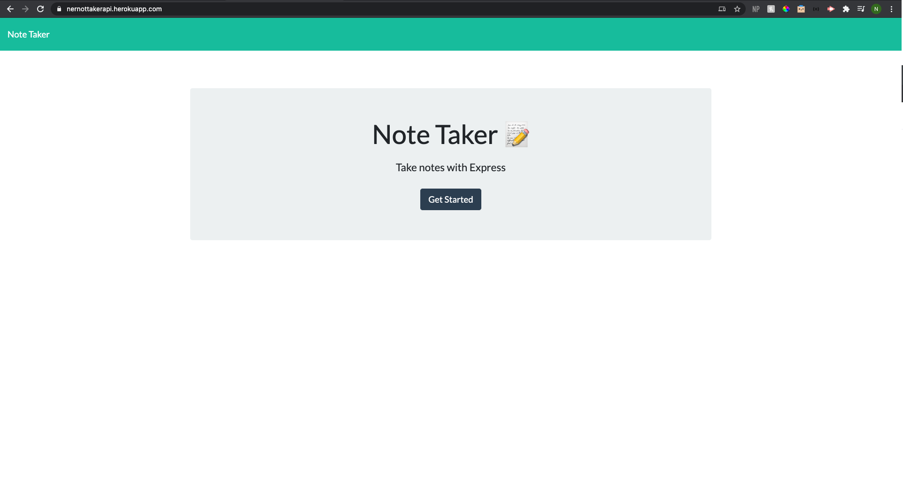
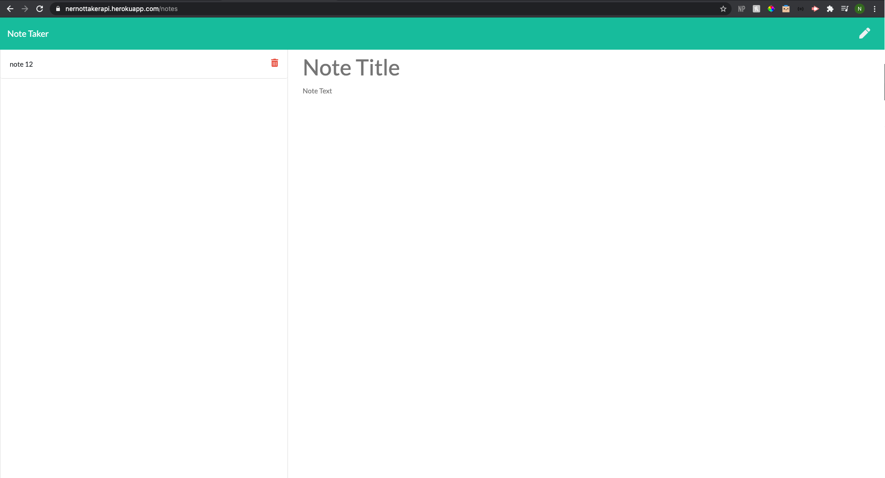
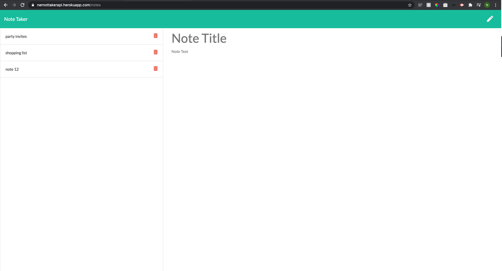
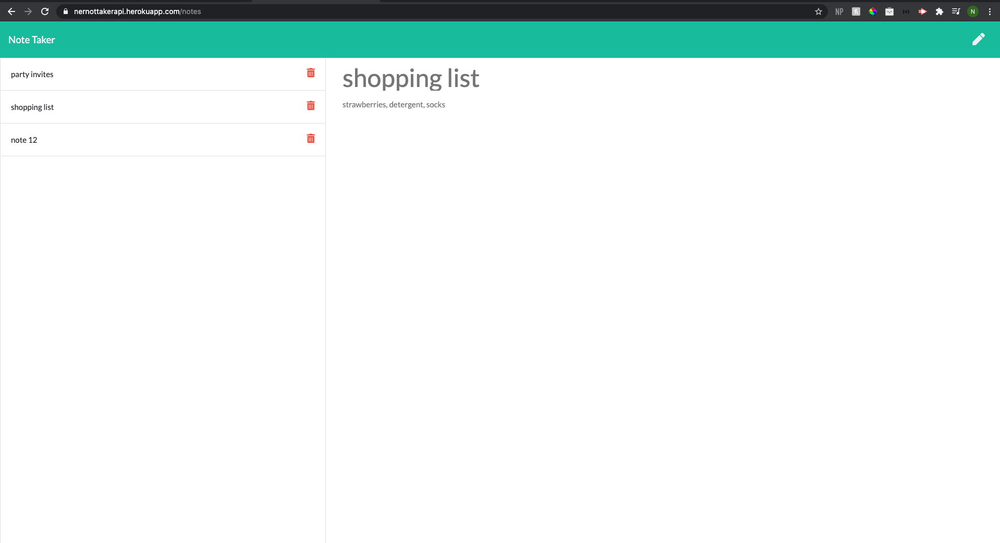
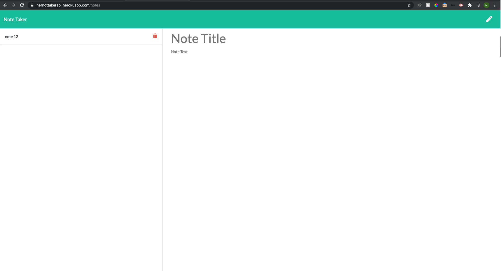

# note_taker
note taker application homework using express 

### Description
This application dynamically can be used to write, save, delete, and review saved notes. This application will use an express backend and save and retrieve note data from a JSON file. 

There are two html routes set up in the htmlroutes.js file; the home page and the notes page. There are three requests set up in the api.js file including get api notes, post api notes, and delete api notes. Together, these routes allow for the user to write, save and delete notes from the backend which is then displayed on the front end using the index.js logic. All notes are written to a backend file called db.json. The public folder and its contents handle the front end of the application. 

This app is also deployed on Heroku. 

    
## Table of Contents
1. [Installation](#installation)
2. [Usage](#usage)
3. [License](#license)
4. [Contributing](#contributing)
5. [Tests](#tests)
6. [Questions](#questions)

### Images of Employee Profile Process

### Step 1

### Step 2

### Step 3

### Step 4

### Step 5

### Installation
In terminal, please make sure to npm init -y and npm i express, then require the package in your js file. 

### Usage
This application can be used to create and delete notes. 

### License 

This application is covered under MIT.

### Contributing 
Pull requests are welcome. For major changes, please open an issue first to discuss what you would like to change.

### Tests
Please make sure to update tests as appropriate.

### Questions
1. [Github](https://github.com/nicoleremy95)

### Link Heroku
1. [NOTE TAKER](https://nernottakerapi.herokuapp.com/)
    
    